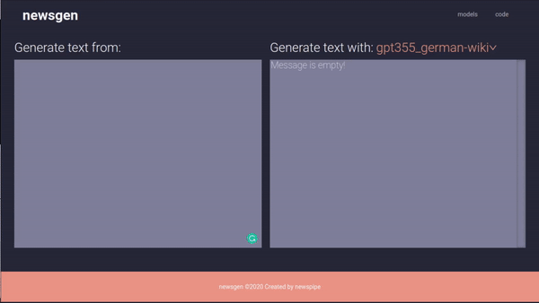

# newsgen



Newsgen is a responsive web application for generating German newspaper articles. The entire stack consists of a React frontend and several Scala Play services. At the moment following services are available:
- gpt2-service-scala: A service to generate texts. It is written in Scala by using the frameworks Tensorflow Java and Play
- ...

The whole application is dockerized and can be started with docker-compose. A deployment to a Kubernetes cluster is in progress.

## Getting started
**Download code and go to project folder:**
```
git clone https://github.com/NewsPipe/newsgen.git
cd newsgen
```

Afterward read the `README.md` at:
- `webapp`: to start the react frontend
- `gpt2-service`: to start the scala play service

## TODO
- Add kubernetes config
- CI pipeline for webapp
- CI pipeline for gpt2 service
- Replace BPE encoder python code with more efficient scala code
